# SLAM AI Mermaid Diagrams

## 1. High-Level System Architecture

```mermaid
graph TB
    User[👤 User] -->|Natural Language Query| Frontend[🖥️ Frontend<br/>React + Vite]
    Frontend -->|POST /chat/completions| Backend[⚡ Backend API<br/>FastAPI]
    Backend -->|visualization_hint| Router{Route by<br/>Metadata}
    
    Router -->|"auto"| SQL[Generate SQL Only]
    Router -->|"table"| SQLTable[Generate SQL + Table]
    Router -->|"bar_chart/line/scatter"| SQLChart[Generate SQL + Chart]
    Router -->|"map"| SQLMap[Generate SQL + Map]
    
    SQL --> SDK[🧠 SLAM AI SDK<br/>LangChain]
    SQLTable --> SDK
    SQLChart --> SDK
    SQLMap --> SDK
    
    SDK -->|Prompt Engineering| LLM[🤖 LLM Provider<br/>OpenAI/vLLM/Local]
    LLM -->|Response| Parser[📝 Output Parsers]
    Parser -->|Validated| ToolCalls[🔧 Tool Calls]
    
    ToolCalls -->|JSON Response| Frontend
    Frontend -->|Render| Viz[📊 Visualizations<br/>SQL/Table/Chart/Map]
    
    style User fill:#e1f5ff
    style Frontend fill:#fff4e1
    style Backend fill:#ffe1f5
    style SDK fill:#e1ffe1
    style LLM fill:#f5e1ff
    style Viz fill:#fff4e1
```

---

## 2. Intent to Action Mapping

---

## 3. Text-to-SQL Chain (Detailed)

---

## 4. Prompt Engineering Flow

---

## 5. System Prompt Templates

```mermaid
graph TB
    subgraph "SQL Generation Prompt"
        SP1[System Prompt:<br/>'You are a SQL expert...']
        SP1 --> V1["{dataset_description}"]
        SP1 --> V2["{schema_description}"]
        SP1 --> V3["{golden_queries}"]
        SP1 --> V4["{additional_prompt}"]
        SP1 --> V5["{natural_language_query}"]
        
        V1 --> I1[Instructions:<br/>• Use full schema.table.column<br/>• Only SELECT relevant columns<br/>• Enclose in ```sql ... ```<br/>• No explanations]
        V2 --> I1
        V3 --> I1
        V4 --> I1
        V5 --> I1
        
        I1 --> OUT1[Output: SQL Query]
    end
    
    subgraph "Vega-Lite Generation Prompt"
        SP2[System Prompt:<br/>'Produce Vega-Lite v5.17.0<br/>specification...']
        SP2 --> V6["{natural_language_query}"]
        SP2 --> V7["{plot_type}"]
        SP2 --> V8["{column_names}"]
        SP2 --> V9["{vegalite_template}"]
        
        V6 --> I2[Instructions:<br/>• Data already filtered<br/>• Date → 'nominal'<br/>• Numeric → 'quantitative'<br/>• Valid JSON only<br/>• No placeholders]
        V7 --> I2
        V8 --> I2
        V9 --> I2
        
        I2 --> OUT2[Output: Vega-Lite Spec]
    end
    
    style SP1 fill:#ffe1e1
    style SP2 fill:#ffe1e1
    style OUT1 fill:#e1ffe1
    style OUT2 fill:#e1ffe1
```

---

## 6. Error Recovery & Auto-Repair

---

## 7. Tool Call Generation

---

## 8. Complete Data Flow

---

## Usage Notes

These diagrams can be rendered in:
- GitHub/GitLab (native support)
- VS Code (with Mermaid extension)
- Online: https://mermaid.live/
- Documentation sites (GitBook, Docusaurus, etc.)

Each diagram shows a different aspect of how system prompts map user intent to actions and responses in the SLAM AI system.
